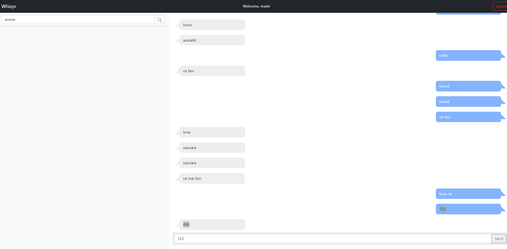

# Whispr

## What is Whispr?

- Whispr is an online chat web application designed to be easy to use, private and secure.

## Features:

### Implemented:

- User accounts can be created and users can log in
- Users can search for friends by their username and start chatting
- Messages are sent and received in rea time, using STOMP

### Missing:

- Creating the chat rooms (currently the user would have to search for the desired contact everytime he wants to start a conversation)
- Message encryption and jwt (currently the message are saved in plain text and there is no token to validate their authenticity)
- Ip based JWT

## Technologies used:

### Server side:
- Spring Boot (v2.7)
- Spring Security
- JWT
- WebSockets
- Jpa
- PostgreSQL

### Client side
- Angular(v14.0)
- SockJs
- StompJs
- Bootstrap

## Screenshots

